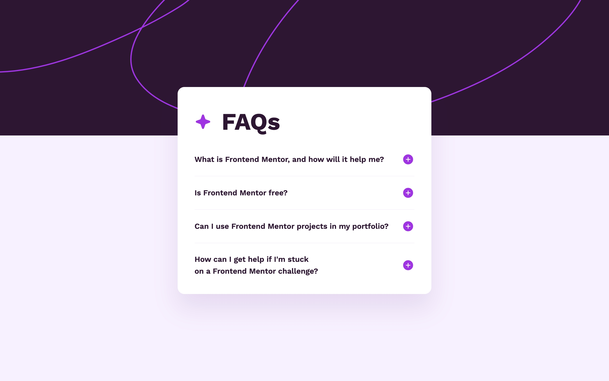
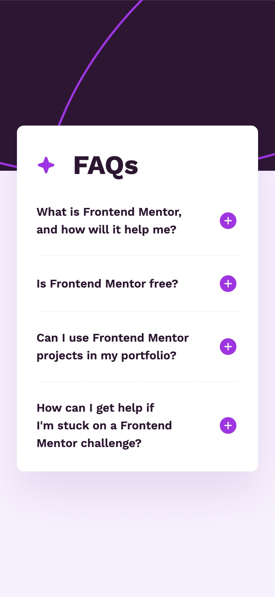

# Frontend Mentor - FAQ accordion solution

This is a solution to the [FAQ accordion challenge on Frontend Mentor](https://www.frontendmentor.io/challenges/faq-accordion-wyfFdeBwBz). Frontend Mentor challenges help you improve your coding skills by building realistic projects.

## Table of contents

- [Frontend Mentor - FAQ accordion solution](#frontend-mentor---faq-accordion-solution)
  - [Table of contents](#table-of-contents)
  - [Overview](#overview)
    - [The challenge](#the-challenge)
    - [Screenshot](#screenshot)
    - [Links](#links)
  - [My process](#my-process)
    - [Built with](#built-with)
    - [Continued development](#continued-development)
  - [Author](#author)

## Overview

### The challenge

Users should be able to:

- Hide/Show the answer to a question when the question is clicked
- Navigate the questions and hide/show answers using keyboard navigation alone
- View the optimal layout for the interface depending on their device's screen size
- See hover and focus states for all interactive elements on the page

### Screenshot

Desktop

Mobile

### Links

- [Live Site URL](https://faq-accordion.frilly.dev)

## My process

### Built with

- Semantic HTML5 markup
- [Astro](https://astro.build)
- [Tailwind CSS](https://tailwindcss.com)
- [Fluid Tailwind](https://fluid.tw)

### Continued development

I expected the next project coming from [Interactive Rating Component](https://interactive-rating-component.frilly.dev) to be a bit more JS-involved so I can try more of Solid.js, turns out this project is completely JS-free. I'm very happy with the result as Frontend Mentor also challenged to make this project without any JavaScript.

## Author

- Website - [frilly.dev](https://www.frilly.dev)
- Frontend Mentor - [@hikawi](https://www.frontendmentor.io/profile/hikawi)
